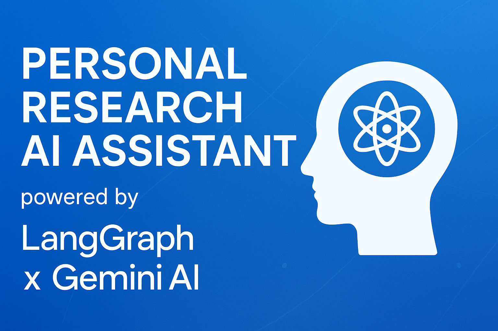

# Personal Research AI Assistant



<div align="center">

**An intelligent research assistant powered by LangGraph, Gemini AI, and advanced parallel execution**

[](https://aiagent-ten-nu.vercel.app)
[](https://railway.app)
[](https://nextjs.org/)
[](https://fastapi.tiangolo.com/)
[](https://langchain-ai.github.io/langgraph/)
[](https://neon.tech/)

[Live Demo](https://aiagent-ten-nu.vercel.app) " [API Docs](https://your-backend-url.up.railway.app/docs) " [Report Bug](https://github.com/yourusername/aiagent/issues)

</div>

---

## =� Table of Contents

- [Overview](#overview)
- [Features](#features)
- [Tech Stack](#tech-stack)
- [Architecture](#architecture)
- [Project Structure](#project-structure)
- [Database Schema](#database-schema)
- [API Documentation](#api-documentation)
- [Getting Started](#getting-started)
- [Environment Variables](#environment-variables)
- [Deployment](#deployment)
- [Usage](#usage)
- [Contributing](#contributing)
- [Contact](#contact)
- [License](#license)

---

## <� Overview

**Personal Research AI Assistant** is an intelligent web application that combines the power of Google Gemini 2.5-flash, academic paper search (arXiv), and Google Search to provide comprehensive research answers with long-term memory. The platform also features AI-powered LinkedIn post generation to transform research insights into engaging social media content.

### Why This Project?

- **Parallel Execution**: Uses LangGraph to run multiple AI tools simultaneously, reducing response time
- **Long-term Memory**: Remembers your research history to provide contextual follow-up answers
- **Real-time Streaming**: See which tools are running in real-time via Server-Sent Events
- **Content Generation**: Transform research into professional LinkedIn posts with customizable styles

---

## ( Features

### =
 AI-Powered Research
- **Parallel Tool Execution**: Simultaneously queries Google Search and arXiv using LangGraph workflows
- **Multi-Source Intelligence**: Combines web search results with academic papers for comprehensive answers
- **Extended Thinking Mode**: Leverages Gemini's deep reasoning capabilities for complex queries
- **Real-time Streaming**: Live updates showing which tools are active during research
- **Session Management**: Organize research into sessions with full conversation history

### >� Long-term Memory
- Automatically stores all research queries and responses
- Retrieves relevant past research to provide contextual answers
- Persistent storage in PostgreSQL for reliable access across sessions

### =� LinkedIn Post Generation
- **AI-Powered Content**: Generate engaging LinkedIn posts from research content
- **Customizable Styles**: Choose from Professional, Casual, or Storytelling formats
- **Flexible Tones**: Educational, Promotional, Thought Leadership, or Inspirational
- **Length Options**: Short (500-800), Medium (1000-1500), or Long (2000-3000) characters
- **Auto-Enhancement**: Automatic hashtag generation and emoji placement
- **Draft Management**: Save, edit, and track posted/draft status

### = Authentication & User Management
- **Clerk Integration**: Secure OAuth authentication with multiple providers
- **Automatic Sync**: User data synchronized to PostgreSQL on login
- **JWT Verification**: Secure API access with token-based authentication

---

## =� Tech Stack

### Frontend
| Technology | Version | Purpose |
|------------|---------|---------|
| **Next.js** | 15.5.5 | React framework with App Router |
| **React** | 19.1.0 | UI library |
| **TypeScript** | 5 | Type-safe JavaScript |
| **Clerk** | 6.33.3 | Authentication & user management |
| **Tailwind CSS** | 4 | Utility-first styling |
| **Radix UI** | Latest | Accessible component primitives |
| **Framer Motion** | 12.23.24 | Animation library |
| **React Hook Form** | Latest | Form handling |
| **Zod** | Latest | Schema validation |
| **Zustand** | 5.0.8 | State management |
| **Axios** | 1.12.2 | HTTP client |
| **React Markdown** | Latest | Markdown rendering |
| **Sonner** | 2.0.7 | Toast notifications |

### Backend
| Technology | Version | Purpose |
|------------|---------|---------|
| **FastAPI** | 0.119.0 | Modern Python web framework |
| **Python** | 3.12 | Programming language |
| **Uvicorn** | 0.37.0 | ASGI server |
| **LangChain** | 0.3.27 | LLM orchestration |
| **LangGraph** | 0.6.10 | Workflow graph framework |
| **Google Gemini** | 2.5-flash | AI language model |
| **SQLAlchemy** | 2.0.44 | ORM with async support |
| **PostgreSQL** | Latest (Neon) | Cloud database |
| **Alembic** | 1.17.0 | Database migrations |
| **Clerk** | Latest | JWT verification |
| **arXiv API** | 2.1.0 | Academic paper search |
| **httpx** | 0.28.1 | Async HTTP client |

### Infrastructure
- **Frontend Hosting**: Vercel
- **Backend Hosting**: Railway
- **Database**: Neon PostgreSQL (serverless)
- **Authentication**: Clerk

---

## <� Architecture

### LangGraph Parallel Execution Workflow

The core intelligence uses LangGraph to orchestrate parallel AI tool execution:

```

